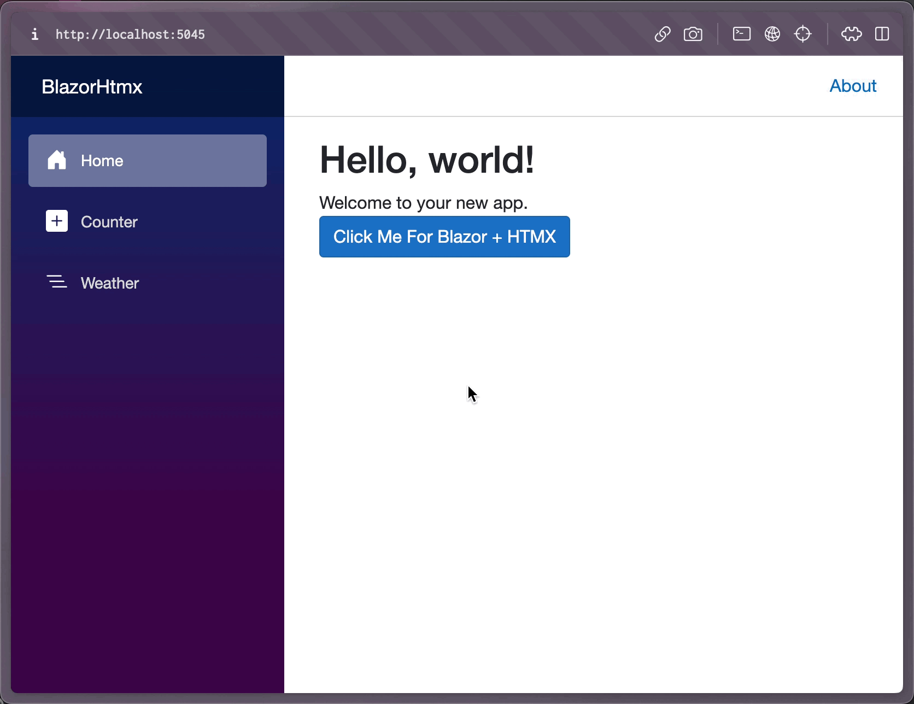

# ASP.NET Core Blazor Streaming HTMX Extension

This repository is strictly for demonstration purposes and is based off of an original demonstration by [Khalid Abuhakmeh](https://github.com/khalidabuhakmeh).  Khalid is the originator of the [Htmx.net] https://github.com/khalidabuhakmeh/Htmx.Net) nuget package, which provides server-side helper methods for HttpRequest and HttpResponse.  As for me (Michael Tanczos), I'm not a javascript expert.  I'm an explorer looking to find ways to utilize the powerful component model available inside Blazor as an engine to work in tandem with htmx with as minimal a payload as is possible. The community around mixing Htmx and Blazor 8 SSR is fragmented but I believe has a lot of potential to grow and I'm not sure where else to turn.

This article itself is a fork of Khalid's original repository, which demonstrated how to integrate Htmx with Blazor Web.  Blazor Web has a sizeable javascript dependency called "blazor.web.js" that has to load prior to making Blazor Streaming accessible to the client. The purpose of this repository is to demonstrate that Blazor SSR Streaming can work with Htmx as an extension.  

Minified and compressed, the extension blazor-streaming.js is roughly 1.2 KB in size.  That being said, it is NOT a replacement for blazor.web.js and simply is an implementation of Blazor SSR streaming that works in tandem with Htmx.  This is a very early technical experiment to see if this is feasible.

<video src="blazorhtmx.mp4"></video>

## What can this extension do?

**Enhanced navigation is not part of this extension. At present it primarily handles streaming html**.

This extension allows you to load streamed Blazor content into any page without needing "blazor.web.js" first and foremost.  The HTMX extension aspect of it allows you to use HTMX to request streaming Blazor pages and to have that streaming content render in place. The approach that it uses is to interact with the ajax request as it is streaming and load content into a temporary container div that is swapped into place using whatever hx-swap method you like.  Any Blazor streaming enhancements are swapped into place as they are loaded into the dom.  

With the release of .NET 8, developers now have access to multiple rendering modes. One of those rendering modes is Static Server Rendering. This means you can render Blazor pages with component hierarchies as plain-old HTML pages.

Finally, there is a new `RazorComponentResult<T>` that allows any ASP.NET Core endpoint (Minimal API, Razor Pages, or MVC) to return a rendered Blazor component.

We can put all these pieces together to allow for HTMX support in a Streaming Blazor application.

Follow the steps below:

## Step 1. Update App.Razor with Resources

I updated the `App.Razor` file to include the HTMX script, along with a necessary 
JavaScript implementation that you'll see later.

```html
<!DOCTYPE html>
<html lang="en">

<head>
    <meta charset="utf-8"/>
    <meta name="viewport" content="width=device-width, initial-scale=1.0"/>
    <base href="/"/>
    <link rel="stylesheet" href="bootstrap/bootstrap.min.css"/>
    <link rel="stylesheet" href="app.css"/>
    <link rel="stylesheet" href="BlazorHtmx.styles.css"/>
    <link rel="icon" type="image/png" href="favicon.png"/>

    <script defer src="https://unpkg.com/htmx.org@1.9.8"></script>
    <script defer src="js/blazor-streaming.js"></script>
    <HeadOutlet/>
</head>
<body>
<Routes/>
</body>
</html>
```

## Step 2. Implement a page that uses StreamRendering

Let's use the classic boilerplate Weather.razor page as an example.  I created a second streaming component called "MoodLoader" that does a longer asynchronous wait of 5 seconds before rendering.  In the end it just displays "My mood is happy".  In `Pages/Weather.razor` we add the following HTML.

```html
@page "/weather"
@attribute [StreamRendering]

@using BlazorHtmx.Components.Layout

<PageTitle>Weather</PageTitle>

<h1>Weather</h1>

<p>This component demonstrates showing data.</p>

<MoodLoader/>

@if (forecasts == null)
{
    <p>
        <em>Loading...</em>
    </p>
}
else
{
    <table class="table">
        <thead>
        <tr>
            <th>Date</th>
            <th>Temp. (C)</th>
            <th>Temp. (F)</th>
            <th>Summary</th>
        </tr>
        </thead>
        <tbody>
        @foreach (var forecast in forecasts)
        {
            <tr>
                <td>@forecast.Date.ToShortDateString()</td>
                <td>@forecast.TemperatureC</td>
                <td>@forecast.TemperatureF</td>
                <td>@forecast.Summary</td>
            </tr>
        }
        </tbody>
    </table>
}

@code {
    private List<WeatherForecast>? forecasts;

    protected override async Task OnInitializedAsync()
    {
        // Simulate asynchronous loading to demonstrate streaming rendering
        await Task.Delay(500);

        var startDate = DateOnly.FromDateTime(DateTime.Now);
        var summaries = new[] { "Freezing", "Bracing", "Chilly", "Cool", "Mild", "Warm", "Balmy", "Hot", "Sweltering", "Scorching" };
        forecasts = Enumerable.Range(1, 5).Select(index => new WeatherForecast
        {
            Date = startDate.AddDays(index),
            TemperatureC = Random.Shared.Next(-20, 55),
            Summary = summaries[Random.Shared.Next(summaries.Length)]
        }).ToList();
    }
    
    private class WeatherForecast
    {
        public DateOnly Date { get; set; }
        public int TemperatureC { get; set; }
        public string? Summary { get; set; }
        public int TemperatureF => 32 + (int)(TemperatureC / 0.5556);
    }

}
```

At this point you can make requests to the /weather endpoint and it will render properly so long as HTMX and js/blazor-streaming.js are included.

## Step 3. Invoking the Page Endpoint via HTMX

We need to wire up HTMX at this point, and that's easy. In `Components/Layout/NavMenu.razor` note the following HTML.  On the nav element in order to enable Blazor Streaming you have to add the attribute hx-ext="blazor-streaming" along with any other HTMX attributes you desire.  That's it.

```razor
    <nav class="flex-column" hx-ext="blazor-streaming" hx-boost="true" hx-target="article" hx-swap="innerHTML">
        <div class="nav-item px-3">
            <NavLink class="nav-link" href="" Match="NavLinkMatch.All">
                <span class="bi bi-house-door-fill-nav-menu" aria-hidden="true"></span> Home
            </NavLink>
        </div>

        <div class="nav-item px-3">
            <NavLink class="nav-link" href="counter">
                <span class="bi bi-plus-square-fill-nav-menu" aria-hidden="true"></span> Counter
            </NavLink>
        </div>

        <div class="nav-item px-3">
            <NavLink class="nav-link" href="weather">
                <span class="bi bi-list-nested-nav-menu" aria-hidden="true"></span> Weather
            </NavLink>
        </div>
    </nav>
```

## Step 4. Run it!

You can see the image below that we can both invoke HTMX, navigate away and back, and invoke it again. Sweet!




## Conclusion

It's possible to use HTMX with Blazor components, you just need to be aware of the Blazor lifecycle events and must reprocess HTMX between enhanced page loads. 

Cheers 🍻